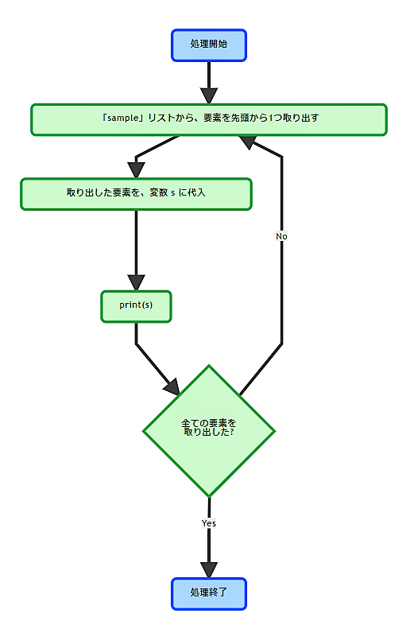
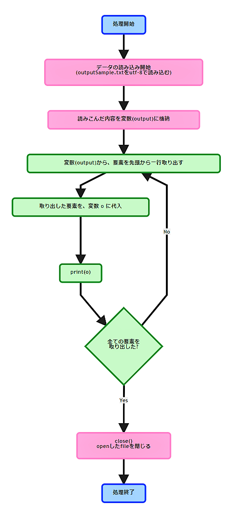
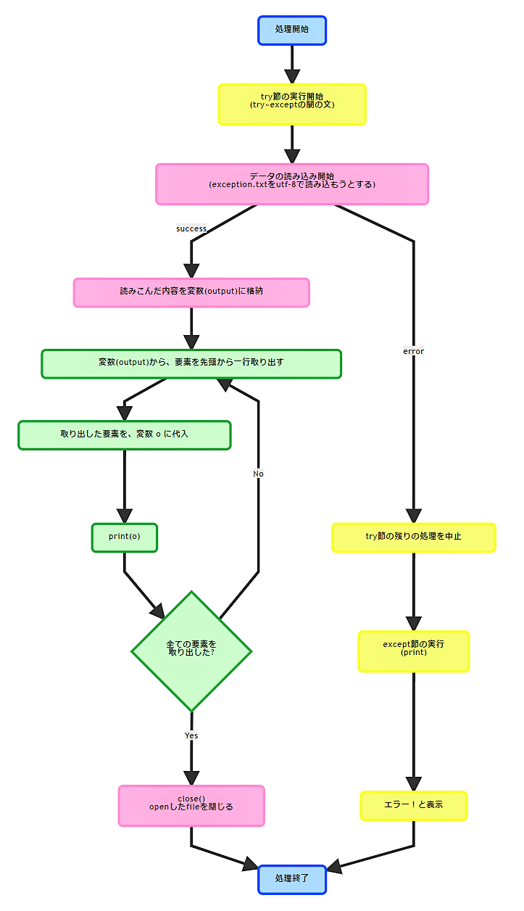
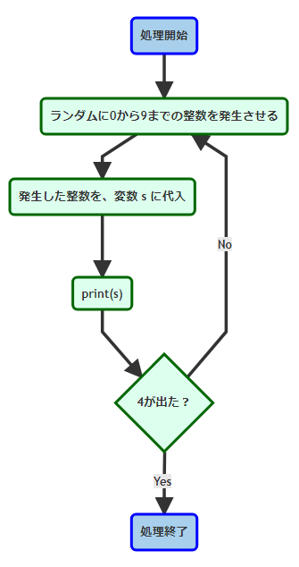

<!-- page_number: true -->

# 第4回 Pymee

---

# 事前準備確認

+ Pythonのインストール
+ テキストエディタのインストール(vi, vimでも可)
+ 勉強資料のダウンロード


# 参加にあたっての注意事項
+ 私用PCは執務室で使用しないで下さい
+ zoom配信を行いますのでご了承下さい
  + 録画も行います
+ 不明点は気軽に聞いて下さい！

---

# 今日の内容

1. 前回のおさらい(for文/ファイル読み込み)
1. while文
1. ファイル書き込み
1. module

---
# 今回の講義で利用する知識

今回の講義は前回までの講義を踏まえた上で実施します。

+ for文
+ ファイル読み込み
+ 例外

---
# 前回のおさらい

前回学んだコードをおさらいしましょう。

---

# for文
```python
#「sampleList」という名前のリストを作成
sampleList = [1,2,3,4,5]

#for文で「sampleList」の中身を一つずつ取り出してループ
#先頭から取り出して末尾までループする。
for number in sampleList:
    print(number)
```
+ 出力結果
```
1
2
3
4
5
```
+ リストから値を取得して、先頭から１つずつ値を取り出しながら繰り返し(ループ)処理を実装できました。
---


---

# ファイル読み込み
```python
#読み込むファイルを指定。
#この書式で記載すると以下の通りに値が格納される。
#　・ファイル読み込み元：
#      inputSample.txt
#　・ファイルから読み込んだ中身の格納先：
#      inputAll(一行ずつリスト形式で格納される)
inputAll = open("inputSample.txt", "r",encoding="utf-8")

#ファイルから読み込んだ中身を一行ずつfor文で出力する。
for inputLine in inputAll:
    print (inputLine, end='');

#見やすいように最後に改行を入れる
print('\n')

#ファイルを読み込んだ後はクローズ処理を記載する。
#これを書かないとメモリにゴミが残る。(動作が重くなっていく)
inputAll.close()
```
---
+ 出力結果
```
【大吉】
待人：辛抱強く待つべし
失物：足元にあり
恋愛：深入りするな
転居：無理せず待て
```
---
+ ソースコード(.pyファイル)を配置したフォルダと同じフォルダに配置された「inputSample.txt」を読み込む事ができました。
---

---
---

# 例外
```python
#エラーが発生した際に別処理へ遷移させたい箇所をtry～exceptで囲む。
#基本的に全部でいい。
try:

#例文として存在しないファイルを指定
#ファイル名を間違ったりして存在しないファイルを
#指定するとエラーになります。
    inputAll = open("exception.txt", "r",encoding="utf-8")

    for inputLine in inputAll:
        print (inputLine, end='');

    print('\n')

    inputAll.close()

#上記のexception.txtが存在しない為、
#エラーが発生して以下のexceptと記載された箇所の処理が実行される。
#
#エラーが発生しなかった場合はexcept句に記載されたコードは
#実行されない。
except:
    print("エラー！")
```
---
+ 出力結果
```
エラー！
```
---
+ try～exceptを記載する事で、処理に失敗した場合のフォローができました。<br>
　⇒エラーが発生した箇所でプログラムが実行することを防げます。
---


---
# 思い出せましたか？この知識を前提に、本日の講義を行います。
---
# while文とは？

while文も、基本的にはfor文のように繰り返し処理を実行する構文です。<br>
for文は、リストのように個数が決まっているデータに順々にアクセスする場合に便利でした。<br>
while文は、繰り返し処理を回し続けるか、ストップするかを条件式で決めることができます。

---


---
【例文(while文)】
```python
#ランダムで値を取り出す為の準備
import random

#変数numの最初の数字を定義
num = 0

#while文で条件、および処理を定義「4以外の数字が出るまで変数numで0-9の乱数を表示する」
while num != 4:
	num = random.randint(0,9)
	print(num)
```
+ 出力結果
```
1
8
8
9
0
8
0
4
```
---
最初はnumが0なので、while文の条件を満たし、ブロックの中のコードが実行され、0-9の乱数が発生して変数に格納されます。2回目以降もこの動作を繰り返します。「4以外の数字」の条件を満たす間はループを継続し、num が 4 であれば条件を満たさないので、while文はそこで終了します。

---
## サンプルプログラムを作ってみましょう(while文)

【事前準備】<br>
デスクトップ(どこでもいいです)に作業フォルダを作成し、そこへ以下の名前でテキストファイルを作成して下さい。<br>
作成したファイルにサンプルプログラムを記載して保存して下さい。<br>
引数に指定するテキストファイル (while.txt) はこちらで用意したものを作業フォルダにコピーしておいてください。<br>
※尚、全部コピペで張ってしまってOKですが、コードに慣れる為に余裕がある方は手打ちしてみてください。<br>

+ ファイル名

```
01_while.py
```
---

【サンプルプログラム】

```python
#sysモジュールで引数をチェックする準備
import sys
import random

#ファイルを格納するためのリストを準備
WhileList = []

#引数に読み込むファイルを指定してオープン
f = open(sys.argv[1], "r",encoding="utf-8")

#readline()で1行ずつ読み込み
line = f.readline()

#while文で処理を定義「取り出した行が "EOF" 以外なら1行ずつWhileListに格納」
while line != "EOF\n":
	WhileList.append(line)
	line = f.readline()

#読み込んだファイルをクローズ
f.close

#ランダムでリストから結果を取り出し
kekka = random.choice(WhileList)

#結果を表示
print(kekka)
```
---
コードが書けたら以下のコマンドで実行してみましょう。
+ 実行(windowsの場合)

```
py 01_while.py while.txt
```
+ 実行(その他の場合)

```
python3 01_while.py while.txt
```
+ 出力結果
```
大吉,待人：すぐに来る,失物：足元にあり,恋愛：深入りするな,転居：無理せず待て
```
---
引数に指定した "omikujifile.txt" から1行ずつ取り出していき、EOFの行に差し当たると条件を満たさないので取り出さずに処理を停止します。<br>
さらに出来上がったWhileListからランダムに1行取り出し、表示しています。<br>
しかし、このままだと見ずらいですね。解決策は後でご紹介します！

---
# ファイルを書き込んでみよう。

前回、ファイル読み込みを学びましたが、今回はファイルへ書き込む方法を学びましょう。

---


---
【例文(ファイル書き込み)】

```python
#書き込むファイルを新規作成
f = open('kakikomi.txt','x')

#新規作成したファイルに書き込み
f.write('楽しいPython')

#書き込んだファイルを閉じる
f.close()

```
---
+ 出力結果
```
楽しいPython
```
作業ディレクトリに"kakikomi.txt"が作成され、「楽しいPython」と書き込まれていることが確認できます。

---
## サンプルプログラムを作ってみましょう(ファイル書き込み)

【事前準備】<br>
引数に指定するテキストファイル (write_file.txt) はこちらで用意したものを作業フォルダにコピーしておいてください。

+ ファイル名

```
02_file_write.py
```
【サンプルプログラム】

```python
import sys

#引数に読み込むファイルを指定してオープン
omikuji = open(sys.argv[1], "r",encoding="utf-8")

#書き込み先のファイルを新規作成してオープン
f = open('write_kekka.txt','x')

#上部飾りを挿入
f.write("===============================\n")

#ファイルから読み込んだリストを一行ずつ最終行までfor文で書き込み
for i in omikuji:
    f.write(i)

#改行して下部飾りを挿入
f.write("\n")
f.write("===============================\n")

#ファイルクローズ
f.close()
```
---

+ 実行(windowsの場合)

```
py 02_file_write.py write_file.txt
```
+ 実行(その他の場合)

```
python3 02_file_write.py write_file.txt
```
+ 出力結果（write_kekka.txt）
```
===============================
【大吉】
待人：辛抱強く待つべし
失物：足元にあり
恋愛：深入りするな
転居：無理せず待て
===============================
```

読み込んだファイルの内容の上下に飾りを挿入し、別ファイルに書き込むことができました。

---
# importとは
importとは、pythonで書かれたコードを再利用するために使用します。<br>
importはコードの先頭に以下のように記述します。<br>

```
import モジュール
```
---
# モジュール（module）とは

モジュールとは、pythonのファイル（.py）の事です。<br>

ある程度長いプログラムをpythonで書く場合などは、コマンドラインではなく.pyファイルに実行したい内容を保存します。
その保存された.pyファイルは、他のpythonのプログラムからimportで呼び出して使うことが出来ます。<br>
<br>
これをモジュールと呼びます。<br>
<br>
つまり、実行させたい内容を他の.pyファイルに書いておき、それをimportで呼び出すイメージです。

---

# datetimeモジュールをimportしてみよう。

datetimeモジュールは、日付や時刻に対して色々な操作をすることが出来るモジュールです。<br>
datetimeモジュールには、日付や時刻を扱うためのクラスが用意されています。<br>
<br>
datetimeには大きく分けて、3種類のクラスがあります。<br>

|クラス|説明|
|:--|:--|
|date|主に日付を表現|
|time|時刻を表現|
|datetime|日付と時刻を合わせて表現|

まずは、datetimeモジュール全体をimportしたいときの方法です。
```
import datetime
```
これで、datetimeモジュールの機能がすべて使えるようになりました。

---

しかし、モジュールによってはたくさんのpythonファイルが含まれており、pythonの実行速度を落としてしまうこともあります。
そんな時、使用したい機能（クラス）だけimportできればいいですね。<br>
<br>
そこで、以下の書式でクラスだけを呼び出すことができます。<br>
<br>
```
from モジュール import クラス
```
これにしたがい、

```
from datetime import datetime
```

これで、datetimeモジュールのdatetimeクラスのみ呼び出すことができました。<br>
では実際にコードに組み込んでみましょう。


```python
#エラーが発生した際に別処理へ遷移させたい箇所をtry～exceptで囲む。
#基本的に全部でいい。
try:

#例文として存在しないファイルを指定
#ファイル名を間違ったりして存在しないファイルを
#指定するとエラーになります。
    inputAll = open("exception.txt", "r",encoding="utf-8")

    for inputLine in inputAll:
        print (inputLine, end='');

    print('\n')

    inputAll.close()

#上記のexception.txtが存在しない為、
#エラーが発生して以下のexceptと記載された箇所の処理が実行される。
#
#エラーが発生しなかった場合はexcept句に記載されたコードは
#実行されない。
except:
    print("エラー！")
```
</font>

---

+ 出力結果
```
エラー！
```

---

## ポイント
+ try～exceptを記載する事で、処理に失敗した場合のフォローができる。
　⇒エラーが発生した箇所でプログラムの実行がする事を防げる。

## 用途
+ 中途半端に動いてしまった際の後始末
+ 発生したエラーの詳細をログファイルへ記載
etc...

---
## サンプルプログラムを作ってみましょう(例外)

+ ファイル名

```
03_except.py
```

---

【サンプルプログラム】(1/2)
```python
#エラー発生時の詳細取得準備
import sys

#エラーが発生した際に別処理へ遷移させたい箇所をtry～exceptで囲む。
try:

#例文として存在しないファイルを指定
    inputAll = open("exception.txt", "r",encoding="utf-8")

    for inputLine in inputAll:
        print (inputLine, end='');

    print('\n')

```
---
【サンプルプログラム】(2/2)
```python
#ファイルが見つからない時は以下のコードが実行される。
#sys.exc_info()でエラーの詳細を確認できる。
except FileNotFoundError:
    print("ファイル読み込みエラー！")
    print(sys.exc_info())
#その他のエラー発生時は以下のコードが実行される。
except:
    print("その他のエラー！")
    print(sys.exc_info())
#エラーが発生しなかった場合は以下のコードが実行される。
else:
    print('※例外は発生しませんでした')
#以下のコードはどんな場合でも実行される。
finally:
    print('処理終了')
#ファイルがオープンできている場合のみクローズ処理を実施する。
    if 'inputAll' in locals():
        inputAll.close()
```

---

+ 実行(windowsの場合)

```
py 03_except.py
```
+ 実行(その他の場合)

```
python3 03_except.py
```
+ 出力結果
```
ファイル読み込みエラー！
処理終了
Traceback (most recent call last):
～

```
---
## 4つのexcept句
+ except FileNotFoundError:
　⇒対象ファイルが存在しない時に実行される
+ except:
　⇒全てのエラー発生時に実行される
+ else:
　⇒全て正常に処理された場合に実行される
+ finally:
　⇒どんな場合でも実行される

## ポイント
+ 上から順番に処理される
　⇒exceptを一番上に書くとそこで処理されてしまうので、個別エラー処理を先に書く
+ sys.exc_info()でエラーの詳細を取得できる
※事前に「import sys」の記述が必要

---

# まとめ(1/3)
1. 前回のおさらい(リスト/辞書型)

```python
omikuji = ['大吉 すべてよし',
           '中吉 まあまあよし',
           '小吉 よし',
           '吉 すこしよし',
           '凶 わるし',
           ]
print(omikuji[0])
```
```python
omikuji = {"大吉":"すべてよし",
           "中吉":"まあまあよし",
           "小吉":"よし",
           "吉":"すこしよし",
           "凶":"わるし",
           }
print(omikuji["大吉"])
```

---

# まとめ(2/3)
2. for文
```python
sampleList = [1,2,3,4,5]
for sample in sampleList:
    print(sample)
```
3. ファイル入出力
```python
inputAll = open("inputSample.txt", "r",encoding="utf-8")
for inputLine in inputAll:
    print (inputLine, end='');
print('\n')
inputAll.close()
```

---

# まとめ(3/3)
4. 例外
```python
try:
    inputAll = open("exception.txt", "r",encoding="utf-8")

    for inputLine in inputAll:
        print (inputLine, end='');
    print('\n')

except FileNotFoundError:
    print("ファイル読み込みエラー！")
except:
    print("エラー！")
else:
    print('※例外は発生しませんでした')
finally:
    print('処理終了')
    if 'inputAll' in locals():
        inputAll.close()
```
---
## サンプルプログラムを作ってみましょう(まとめ)

前頁を踏まえ、次のコードを作成して下さい。

【事前準備】
事前準備として、以下の内容を記載した３つのテキストファイルを作業フォルダに保存しておいて下さい。

①
+ ファイル名

```
daikiti.txt
```
+ 記載内容

```
【大吉】
待人：辛抱強く待つべし
失物：足元にあり
恋愛：深入りするな
転居：無理せず待て
```

---

②
+ ファイル名

```
kiti.txt
```
+ 記載内容

```
【吉】
待人：待てば来る
失物：見つからず
恋愛：良い出会いあり
転居：南東が良し
```
---

③
+ ファイル名

```
kyo.txt
```
+ 記載内容

```
【凶】
待人：来ない
失物：増える
恋愛：刺される
転居：燃える
```
---
事前準備したファイルとは別に、以下のファイルを作成して下さい。

+ ファイル名

```
04_summary.py
```
---

【サンプルプログラム】(1/3)
```python
import sys
#ランダムで値を取り出す為の準備
import random

#エラーが発生した際に別処理へ遷移させたい箇所をtry～exceptで囲む。
try:

#おみくじ用ファイルを読み込む
    daikiti = open("daikiti.txt", "r",encoding="utf-8")
    kiti    = open("kiti.txt", "r",encoding="utf-8")
    kyo     = open("kyo.txt", "r",encoding="utf-8")

#読み込んだおみくじ用ファイルを辞書型でまとめる
    inputOmikuji = {"大吉":daikiti,
                    "吉":kiti,
                    "凶":kyo}

#ランダムで選択する為のキーとなる単語をリストで用意
    omikujiList = inputOmikuji.keys()

#omikujiListの中からランダムで一つ選ぶ
    randomOmikuji = random.choice(list(omikujiList))
```
---
【サンプルプログラム】(2/3)
```python
#omikujiListからランダムに選んだ運勢(文字列)をキーにしてinputOmikujiにセットしたテキストファイルの中身から選んだ文字列に対応するファイルの中身を読み込む。
    selectOmikuji = inputOmikuji[randomOmikuji]

#読み込んだファイルの中身を1行ずつ取り出す。
    for selectLine in selectOmikuji:
        print (selectLine, end='');

    print('\n')
```
---

【サンプルプログラム】(3/3)
```python
#ファイルが見つからない時は以下のコードが実行される。
except FileNotFoundError:
    print("ファイル読み込みエラー！")
    print(sys.exc_info())
#その他のエラー発生時は以下のコードが実行される。
except:
    print("その他のエラー！")
    print(sys.exc_info())
else:
    print('\nおみくじの結果はどうでしたか？')
#以下のコードはどんな場合でも実行される。
finally:
    if 'daikiti' in locals():
        daikiti.close()
    if 'kiti' in locals():
        kiti.close()
    if 'kyo' in locals():
        kyo.close()
```
---
+ 実行(windowsの場合)

```
py 04_summary.py
```
+ 実行(その他の場合)

```
python3 04_summary.py
```
---
+ 出力結果
※以下のいずれか
```
【大吉】
待人：辛抱強く待つべし
失物：足元にあり
恋愛：深入りするな
転居：無理せず待て
おみくじの結果はどうでしたか？
```
```
【吉】
待人：待てば来る
失物：見つからず
恋愛：良い出会いあり
転居：南東が良し
おみくじの結果はどうでしたか？
```
```
【凶】
待人：来ない
失物：増える
恋愛：刺される
転居：燃える
おみくじの結果はどうでしたか？
```

---
# みなさん長い間お疲れ様でした！

---

# 次回予告
+ 繰り返し処理第２弾
+ ファイルの書き込み

今回の範囲外のお話
+ with open

---

# アンケート
+ 今後のよりよい活動のため、アンケートにご協力ください！


https://questant.jp/q/WP4SJ79K

---
# おまけ
オライリーの「退屈なことはPythonにやらせよう」より、都道府県庁所在地クイズジェネレータのソースコードです。
今日の知識＋αで読めますので、講義だけでは物足りなかった方はどうぞ。
https://github.com/oreilly-japan/automatestuff-ja/blob/master/ch08/randomQuizGenerator.py

---
# ご質問など。。。
+ メーリングリストにて、疑問、不明点を気軽に聞いてください！


